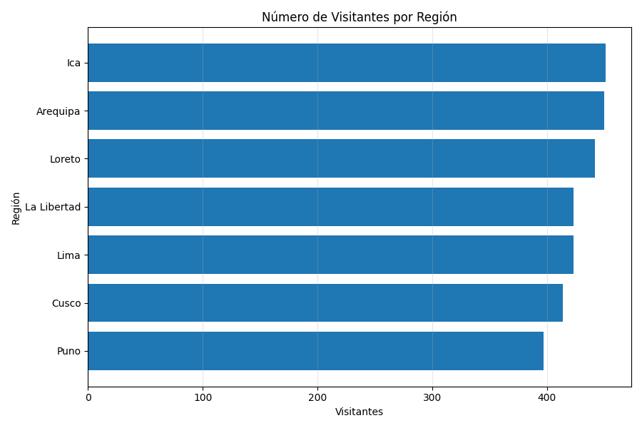

# Turismo Digital · análisis de visitantes

**Un recorrido de datos sintéticos: generación → limpieza → MongoDB → reportes.**

Proyecto académico de análisis turístico. Explora procedencia, destinos, estacionalidad y gasto a partir de un conjunto de visitantes generado con Python. No utiliza registros de turistas reales.

## Qué incluye

- Generación de 3.000 registros base con valores faltantes y duplicados intencionales.
- Limpieza y preparación de un CSV para análisis.
- Carga de datos en MongoDB local.
- Gráficos de visitantes por región, países de origen, tendencia mensual, gasto y duración de la estadía.
- Capturas del proceso y de la ejecución en Jenkins.

## Resultados incluidos



[Países de origen](reports/top10_paises_origen.png) · [Tendencia mensual](reports/tendencia_mensual_visitas.png) · [Distribución del gasto](reports/histograma_total.png) · [Estadía y gasto](reports/dias_vs_gasto.png)

Estos gráficos corresponden al conjunto de ejemplo guardado en el repositorio. No representan estadísticas oficiales de turismo.

## Ejecutar el recorrido

Requisitos: Python 3, Jupyter y una instancia de MongoDB local en `localhost:27017`.

```bash
python -m venv .venv
# Activa el entorno virtual según tu sistema.
python -m pip install pandas numpy pymongo matplotlib jupyter
cd scripts
jupyter notebook
```

Ejecuta los notebooks desde `scripts/`, en este orden:

1. `1_Crear_Carpetas.ipynb`
2. `2_Crear_Estructura.ipynb`
3. `3_Generar_Data_Turismo.ipynb`
4. `4_Proceso_ETL.ipynb`
5. `5_Loading_MongoDB.ipynb`
6. `6_Reportes.ipynb`

**Usa una base de pruebas:** el notebook de carga elimina y vuelve a crear el contenido de la colección `TurismoPeru_2025.Visitantes`. La generación también sobrescribe los CSV de ejemplo.

## Organización

| Carpeta | Contenido |
|---|---|
| `scripts/` | Notebooks del recorrido de datos. |
| `data/` | Datos de entrada y generación. |
| `database/` | CSV depurado. |
| `reports/` | Visualizaciones generadas. |
| `ci/` | Evidencias de ejecución en Jenkins. |
| `git/`, `img_vsc/` | Capturas del desarrollo. |

Las capturas de Jenkins documentan ejecuciones previas; no hay un pipeline automático configurado en este repositorio.

## Alcance

Ejercicio académico de Python, pandas, MongoDB y visualización. No es una plataforma de reservas ni un sistema turístico en producción. Las dependencias no están fijadas por versión; puede requerir ajustes al reproducirlo en otro entorno.

**Autor:** Josué Saldaña Fustamante.
